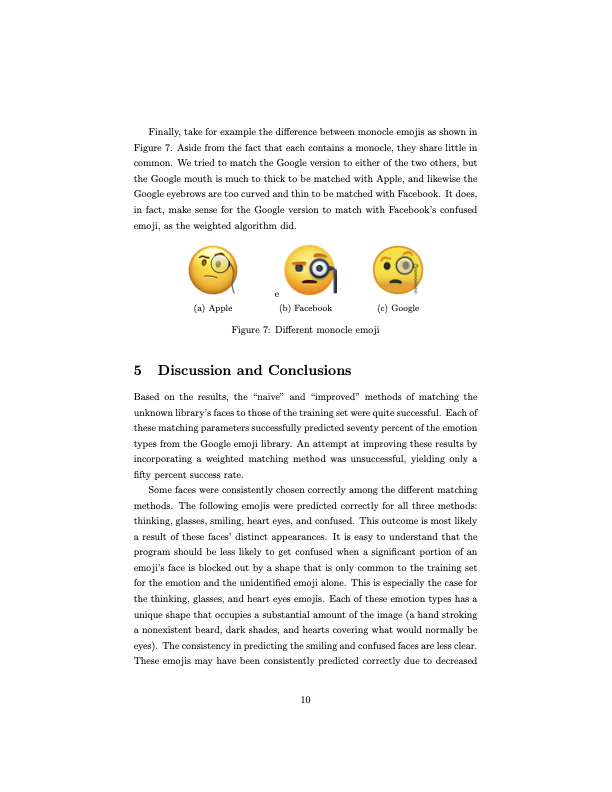

<!-- text scroll -->
<link rel="stylesheet" href"./readme.css">

# Desmond Blue Manthy 

## Coding Playground
*Experimental projects to explore new concepts and skills. Not everything here is polished but they're a lot of fun!*

| Speed [**`PLAYABLE DEMO`**](https://dbmanthy.itch.io/speed) [**`REPO`**](https://github.com/dbmanthy/Speed) | 
| :--- |
|  |
| A quick and dirty project to learn Godot and gdScript |

| Boid Behavioral Model [**`PLAYABLE DEMO`**](https://dbmanthy.github.io/Boids/) [**`REPO`**](https://github.com/dbmanthy/Boids) | Rope & Cloth Physics Simulation [**`PLAYABLE DEMO`**](https://dbmanthy.github.io/Thread-Simulation-Micro/ThreadSimulationBuild/) [**`REPO`**](https://github.com/dbmanthy/Thread-Simulation-Micro) |
| :--- | :--- |
|  |  |
|Followed Craig W. Reynolds's paper, _Flocks, Herds, and Schools_, to simulate animal flocking behavior in Unity | A dynamic 2D rope and cloth physics model using varlet integration in Unity|

| Practice w/ Behavior Trees & State Machines [**`REPO`**](https://github.com/dbmanthy/ugv0) | A* Path Finding in 3D  [**`REPO`**](https://github.com/dbmanthy/MyPrey)|
| :--- | :--- |
| <video src="https://github.com/dbmanthy/dbmanthy/assets/57188665/c097ce43-16a5-4dbe-993a-85916adda7bc" height="350px"></video> | <video src="https://github.com/dbmanthy/dbmanthy/assets/57188665/c922f530-9573-40d1-9276-c3b31eea3cd6" height="350px" loop></video> |
|Played around with different implementations of state machines and behavior trees for a flight controller in an auto-building world | Implemented A* pathfinding algorithm in 3D|

## Project Showcase
<!--  -->

| Emoji Translator [**`FULL REPORT MATH & CODE`**](./media/Emoji_Translator_Final_Report.pdf) | Wave Propagation Fourier [**`FULL REPORT & MATH`**](./media/Wave_Propagation_Fourier.pdf)|
| :--- | :--- |
| |  |
|In a world with many non-related software companies and data libraries, conversion algorithms are vital for cross-platform communication. In this project, a basic facial recognition program was created capable of discerning between ten different emoji faces. This program was implemented using an approach based on Muller, Magaia, and Herbst’s paper[2] on facial recognition. Through the use of training sets generated from Facebook and Apple’s emoji libraries, facial averages of eigenfaces were created using the method of SVD factorization. A new unknown set of emoji faces were then compared against these averages and thus matched into their intended emoji expression (Smiley face, laughing face, etc.) by a least squares fit. Through multiple trials, our program was found to have a seventy percent success rate in sorting these unknown emojis, from Google’s library, into their proper categories.| This project is an introductory investigation of water waves and dispersive relations. There were two contrasting experiments conducted in order to show the important mechanics of water waves in different settings and circumstances. First, a physical experiment was conducted by dropping marbles into a bucket of water and observing the resulting waves. From this, we were able to predict a surface tension value of around .01 N/m and create two accurate functions for phase and group velocity of the system. In the second experiment, we gathered data taken from a paper where ocean waves were measured as they propagated past four different locations in the Pacific. This allowed us to discover the differences between two different dispersion relation models. It was also a thorough way to outline the accuracy and importance of using the theoretical dispersion relation to predict water wave outcomes like "time of arrival".|

| Radial Basis Functions A4 [**`FULL REPORT MATH & CODE`**](./media/Radial_Basis_Functions.pdf) | Radial Basis Functions A1 [**`CODE`**](./media/FD4.m)|
| :--- | :--- |
|  |  |
| | |

| PadeÃÅ Approximations [**`FULL PRESENTATION`**](./media/PadeÃÅ_Approximations.pdf) | Radial Basis Functions & Neural Networks [**`FULL PRESENTATION`**](./media/Radial_Basis_Functions_and_Neural_Networks.pdf)|
| :--- | :--- |
|  |  |

<!--- snake -->
<!---

  </a>

-->

<!--
**dbmanthy/dbmanthy** is a ✨ _special_ ✨ repository because its `README.md` (this file) appears on your GitHub profile.

Here are some ideas to get you started:

- 🔭 I’m currently working on ...
- 🌱 I’m currently learning ...
- 👯 I’m looking to collaborate on ...
- 🤔 I’m looking for help with ...
- 💬 Ask me about ...
- 📫 How to reach me: ...
- 😄 Pronouns: ...
- ⚡ Fun fact: ...
-->
